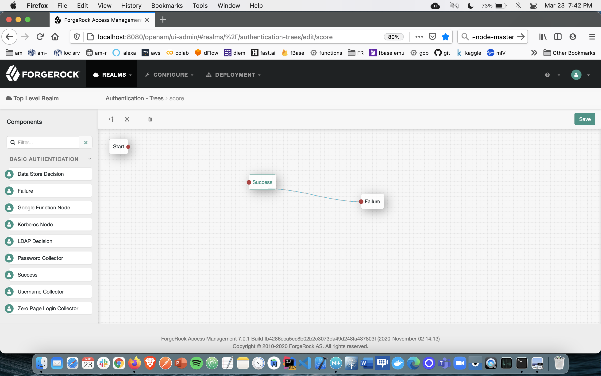
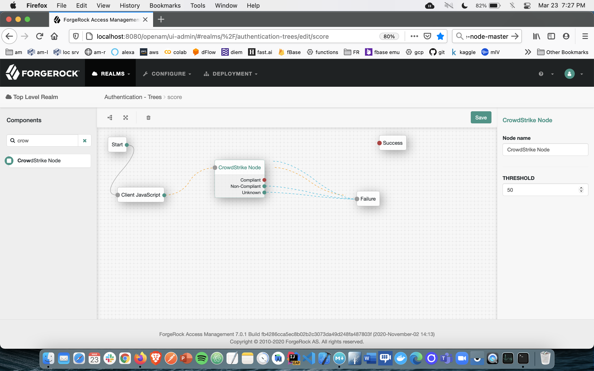
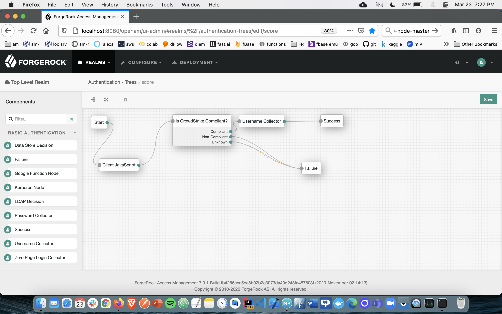

# Zero Trust Assesment Authentication Node

The CrowdStrike Authentication Node allows ForgeRock users to integrate their Access Managment (AM) instance with CrowdStrikes Zero Trust Assesment (ZTA); the first part of this integration uses a browser extensino to read the Overall Assesment score from the device; the second part then uses said value to make a policy decision as part of this Authentication Tree described here.

This document assumes that you already have:
> 1. ForgeRock Access Manager (AM) 7+ instance running with a user base configured
> 2. CrowdStrike Zero Assessment Trust client installed on your device
> 3. A browser that supports extensions (Chrome v90 is used here as the reference platform)
> 4. The [Client Script Auth Node](https://github.com/ForgeRock/client-script-auth-tree-node)

## Configuration in a browser

1. On a device running ZTA, place the files in the [browserExtension](./browserExtension) folder located here in the same directory as the data.zta file

2. Follow the steps to 'unload packed' the extension as described in this [Google Chrome document](https://webkul.com/blog/how-to-install-the-unpacked-extension-in-chrome/)

## Configuration in ForgeRock

The CrowdStrike Auth node is packaged as a jar file; you can either use the maven build tool ('mvn clean install') from the sources here, or use download the pre-built jar from the releases tab at https://github.com/javaservlets/CrowdStrike/releases/latest.

You then will need to deploy into the AM 7+ application WEB-INF/lib folder which is running on a tomcat server.

1. In a new browser window login into the AM console as an administrator and go to `Realms > Top Level Real > Authentication > Trees`.

2. Click on the **Add Tree** button. Name the tree CrowdStrike and click **Create**.

3. Add the tree node **Success** to the canvas:

4. Add the tree node **Client Script** to the canvas. Fill in the value of 'jwt' as in the screenshot: 
 
5. Add the tree node **CrowdStrike**; note the editable threshold value.  In this example, only users who accessing an AM endpoint from a device with a ZTA score above this threshold will be allowed to continue along this authentication journey. 

6. Add the tree node **Username Collector** to the canvas. Configure these nodes as shown in this image, and click the **Save** button on the canvas:

